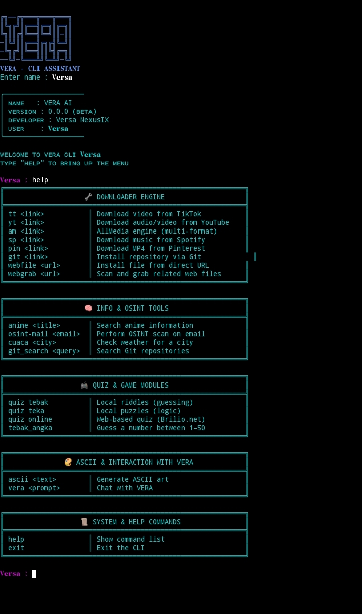

<!-- Logo -->
<p align="center">
  
</p>

<h1 width="200">VERA CLI v0.0.0</h1>

A modular command-line interface for automation, media parsing, and multi-platform bot integration.  
Developed by Versa NexusIX (David) — solo developer and systems architect.

---

## 📌 Overview

VERA CLI is a Python-based system designed for:

- Media downloading (YouTube, TikTok, Pinterest)
- Flexible prompt parsing
- WhatsApp profile scanning
- ASCII generation
- Weather, quiz, anime, and persona handlers

Each module is built for stable input parsing and final output without ambiguity.

---
<p align="center">
  
</p>


---

## ⚙️ Features

- Modular handler system (`handlers/`)
- ASCII banner generator (`utils/ascii.py`)
- Prompt parser with auto-flatten logic (`utils/parse_prompt.py`)
- Multi-format downloader (mp4, mp3, jpg)
- WhatsApp profile scanner (`wa <number>`)
- Quiz engine and weather handler
- Persona tuning for bot identity

---

## 📁 Folder Structure

```bash
vera-cli/
├── cli.py
├── handlers/
│   ├── yt.py
│   ├── tt.py
│   ├── wa.py
│   ├── weather.py
│   ├── quiz.py
│   └── ~~
├── utils/
│   ├── ascii.py
│   ├── anim.py
│   └── ~~
├── assets/
│   └── help.txt
├── requirements.txt
└── README.md
```

---

## 🛠️ Installation

### Linux
```bash
sudo apt update && sudo apt install python3 python3-pip git -y
pip3 install requests colorama yt-dlp beautifulsoup4 pillow pyfiglet selenium
git clone https://github.com/VersaNexusIX/vera-cli.git
cd vera-cli
python3 cli.py
```

### Termux

```bash
pkg update && pkg upgrade -y
pkg install python git -y
pip3 install beautifulsoup4 pillow pyfiglet selenium
git clone https://github.com/VersaNexusIX/vera-cli.git
pip install colorama request yt-dlp
termux-setup-storage
y
cd vera-cli
python cli.py
```

### Run after Exit
```bash
cd vera-cli
python cli.py
```

---
## Example command
```bash
yt https://youtu.be/...      # Download YouTube video
tt https://vm.tiktok.com/... # Download TikTok video
wa 6281234567890             # Scan WhatsApp profile image
ascii Hello World            # Generate ASCII art
cuaca Jakarta                # Get weather info
quiz                         # Start quiz engine
help                         # Show command list
exit                         # Exit CLI
```

---

## 👤 About the Developer

Versa NexusIX (David) is an independent software developer and systems architect based in Central Java, Indonesia. With deep expertise in low-level architecture, emotional AI systems, and cross-platform automation, he builds tools that prioritize stability, precision, and modular design.
David is only 14 years old!. 

He specializes in:

Assembly (ARM64/x86) and OS-level architecture

CLI Design with branded ASCII output and flexible input parsing

API Reverse Engineering and endpoint mapping for audit tools

Cross-platform Bot Integration (Telegram, WhatsApp, SMS, Terminal)

Web Scanning & Forensics for SQL/XLSX/admin panel extraction

UX Logic & Emotional Systems for human-centered automation

David is also known for building VERA CLI, a modular command-line interface that integrates media parsing, bot communication, and emotional prompt handling. His work emphasizes clean code, final output logic, and universal compatibility across platforms.

He actively shares certified learning resources in DevOps, C programming, and system design to support young developers and online communities. Every project is treated as a legacy artefact—documented, versioned, and built to endure.
