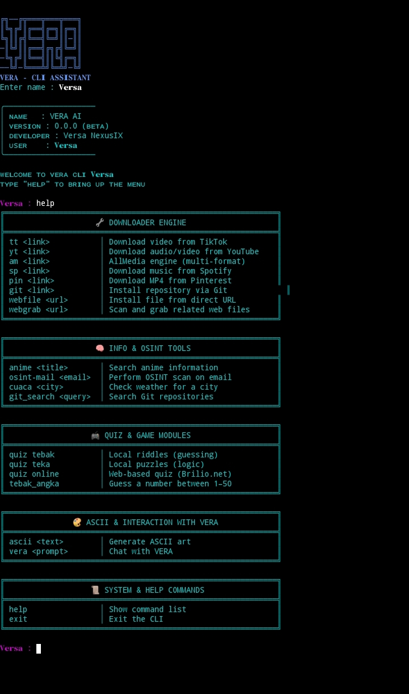

<p align="center">
  
</p>

<h1 align="center">VERA CLI</h1>
<p align="center">
  <strong>Modular Command-Line Interface for Automation, Media Retrieval, and Developer Tooling</strong>
</p>
<p align="center">
  
  
  
  
</p>

---

## Overview

VERA CLI is a Python-based command-line system developed by **Versa NexusIX**, designed for efficient multi-platform automation. It provides a unified interface for media downloading, information gathering, encoding utilities, and lightweight OSINT operations — all from a single terminal session.

Each module is independently structured under the `handlers/` directory, ensuring clean separation of concerns and ease of extension.

<p align="center">
  
</p>

---

## Features

| Category | Capabilities |
|---|---|
| Media Downloader | YouTube, TikTok, Spotify, Instagram, Facebook, X (Twitter), Pinterest |
| Developer Tools | Git clone, GitHub search, web file scraper, web scanner |
| Information and OSINT | IP geolocation, email OSINT, anime lookup, weather, system info |
| Encoding and Cryptography | Base64, URL, Hex, ROT13, SHA-256, MD5, SHA-512 |
| Games and Utilities | Trivia quiz, number guessing game, ASCII art generator |
| System | Persona configuration, session management, alias support |

---

## Project Structure

```
vera-cli/
├── cli.py                  Entry point and command dispatcher
├── config.py               Global configuration and API keys
├── install.sh              Automated installer script
├── requirements.txt        Python dependencies
├── README.md               Project documentation
├── LICENSE                 License information
│
├── handlers/               Command handler modules
│   ├── allmedia.py         AllMedia downloader (Instagram, Facebook via API)
│   ├── anime.py            Anime information via MyAnimeList
│   ├── ascii_gen.py        ASCII art generator
│   ├── botPersona.py       Bot persona viewer and tester
│   ├── cuaca.py            Weather information handler
│   ├── encode_decode.py    Text encoding and decoding
│   ├── fb.py               Facebook downloader via yt-dlp
│   ├── git_search.py       GitHub repository search
│   ├── gitclone.py         Git repository cloning
│   ├── hash_gen.py         Hash generation (MD5, SHA family)
│   ├── ig.py               Instagram downloader via yt-dlp
│   ├── ipinfo.py           IP address geolocation
│   ├── osint_email.py      Email OSINT (Gravatar, Hunter.io, MX)
│   ├── pinterest.py        Pinterest video downloader
│   ├── quiz.py             Trivia quiz engine
│   ├── spotify.py          Spotify track downloader
│   ├── sysinfo.py          System information display
│   ├── tebak_angka.py      Number guessing game
│   ├── tiktok.py           TikTok video, audio, and slide downloader
│   ├── wa.py               WhatsApp scraper (requires Selenium)
│   ├── web_grab.py         Web page grabber
│   ├── web_scanner.py      Web scanner and file extractor
│   ├── webfile.py          Web file scraper and downloader
│   ├── x.py                X (Twitter) downloader via yt-dlp
│   └── yt.py               YouTube MP4 and MP3 downloader
│
├── utils/                  Shared utility modules
│   ├── anim.py             Terminal animations and screen control
│   ├── ascii.py            ASCII banner renderer
│   ├── banner.py           Welcome banner generator
│   ├── media_downloader.py Generic media download utility
│   ├── parse_prompt.py     Prompt parser with auto-flatten logic
│   └── vera_utils.py       File management and media scan utilities
│
├── scraper/
│   └── s_tt.py             TikTok scraper module
│
├── assets/
│   └── help.txt            In-terminal help reference
│
└── Img/
    ├── vera_versa.png       Project logo
    └── Screenshot_*.jpg    Application screenshot
```

---

## Installation

### Requirements

- Python 3.8 or later
- `git` and `ffmpeg` installed on your system
- Internet connection

### Termux (Android)

```bash
pkg install git python ffmpeg -y
git clone https://github.com/VersaNexusIX/vera-cli.git
cd vera-cli
bash install.sh
python3 cli.py
```

### Linux and macOS

```bash
git clone https://github.com/VersaNexusIX/vera-cli.git
cd vera-cli
bash install.sh
python3 cli.py
```

### Manual Installation

```bash
pip install -r requirements.txt
python3 cli.py
```

### Resuming a Session

```bash
cd vera-cli
python3 cli.py
```

---

## Configuration

API keys are configured in `config.py` or via environment variables. Environment variables take precedence.

| Variable | Purpose | Default |
|---|---|---|
| `RAPIDAPI_KEY` | AllMedia downloader API | Required for `am` command |
| `OWM_API_KEY` | OpenWeatherMap API | Bundled key (replace recommended) |
| `HUNTER_API_KEY` | Hunter.io email OSINT | Required for full OSINT output |
| `GEMINI_API_KEY` | Google Gemini AI integration | Optional |

For YouTube downloads, place a `cookies.txt` file at `~/cookies.txt` to bypass bot-check restrictions. Export cookies from your browser using the "Get cookies.txt LOCALLY" extension.

---

## Command Reference

See [docs/COMMANDS.md](docs/COMMANDS.md) for the full command reference.

Quick overview:

```
tt  <url>               TikTok — video, audio, or slide
yt  <url>               YouTube — MP4 or MP3
sp  <url>               Spotify — MP3 or cover art
ig  <url>               Instagram — via yt-dlp
fb  <url>               Facebook — via yt-dlp
x   <url>               X (Twitter) — via yt-dlp
pin <url>               Pinterest — video
am  <url>               AllMedia (Instagram, Facebook via API)
git <url>               Clone a repository
git_search <keyword>    Search GitHub
weather <city>          Current weather
osint-mail <email>      Email OSINT scan
ipinfo [ip]             IP geolocation
encode <method> <text>  Encode text
decode <method> <text>  Decode text
hash <text>             Generate hash
quiz                    Start trivia quiz
ascii <text>            Generate ASCII art
help                    Show full command menu
exit                    Exit VERA CLI
```

---

## Documentation

| Document | Description |
|---|---|
| [docs/COMMANDS.md](docs/COMMANDS.md) | Full command reference with usage examples |
| [docs/CONFIGURATION.md](docs/CONFIGURATION.md) | API key setup and environment configuration |
| [docs/ARCHITECTURE.md](docs/ARCHITECTURE.md) | Module structure and system design |
| [docs/CONTRIBUTING.md](docs/CONTRIBUTING.md) | Contribution guidelines |
| [CHANGELOG.md](CHANGELOG.md) | Version history and release notes |

---

## License

This project is licensed under the MIT License. See [LICENSE](LICENSE) for details.

---

Developed by **Versa NexusIX**
